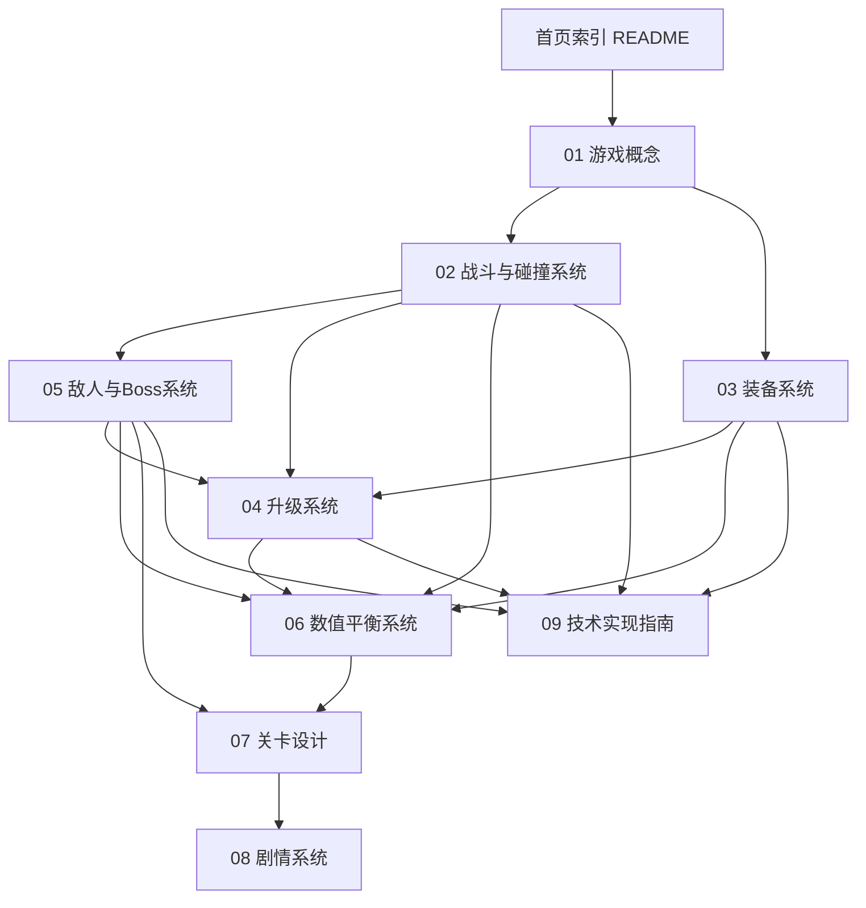
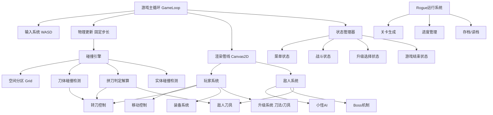

## 产品概述

制作一份"转刀"Rogue游戏的完整设计WIKI，作为后续游戏开发的统一设计蓝图与参考依据。WIKI以Markdown文档集形式组织，涵盖游戏概念、战斗与碰撞系统、装备系统、升级系统、敌人与Boss、数值平衡、关卡设计、剧情脚本及技术实现指南等全部模块，含完整数值表与设计细节。

## 核心特色

- **转刀核心玩法**：玩家仅用WASD移动，角色持刀旋转自动攻击，操作极简但策略丰富
- **双线升级系统**："刀法"等级（旋转技巧：转速/范围/转向/连击）与"刀具"等级（刀具体积/伤害/击退/特效）独立成长
- **拼刀碰撞机制**：玩家刀具与小怪/Boss刀具发生碰撞时的判定、反弹、胜负规则，是战斗核心深度来源
- **装备系统**：多槽位装备、刀具图鉴、套装效果与特殊词条，提供Build多样性
- **Rogue结构**：每局随机生成关卡与升级选择，5-8关精简主线从铁匠铺到武林盟主
- **剧情系统**：铁匠主角的成长线，每关一个阶段性Boss与剧情节点
- **完整数值体系**：伤害公式、属性总表、升级曲线、平衡性分析，确保游戏可玩性与难度梯度

## WIKI产出要求

- 完整设计版：所有模块含具体数值表、属性表、升级曲线、Boss机制、剧情脚本等细节
- 格式：简体中文Markdown文档集，配首页导航索引
- 技术实现章节使用TypeScript代码示例

## 技术栈

### WIKI文档技术

- **文档格式**：Markdown（.md），版本管理友好，GitHub/编辑器直接预览
- **图表工具**：Mermaid语法（系统架构图、数据流图、技能树图），内嵌Markdown代码块
- **数据表格**：Markdown表格呈现所有数值表（属性表、升级曲线、伤害公式参数等）
- **美术素材**：概念图通过多模态内容生成能力产出，存放于 `wiki/assets/concept-art/`

### 游戏技术栈（WIKI文档记录的目标技术）

- **引擎**：HTML5 Canvas 2D + TypeScript（无第三方游戏引擎，自研轻量框架）
- **碰撞引擎**：自研2D碰撞系统，针对旋转刀体优化（线段/扇形碰撞 + 扫掠检测防穿透）
- **渲染**：Canvas 2D Context，分层渲染（背景→实体→特效→UI）
- **游戏循环**：requestAnimationFrame + 固定时间步长物理更新

## 实现方案

### WIKI编写策略

采用"自顶向下、先框架后数值"的编写路径：先建立游戏概念与系统总览，再逐模块深入设计，最后统一数值平衡。每个模块文档包含：设计目标 → 机制详述 → 数值表 → 与其他系统的关联 → 设计备注。

### 核心技术挑战（WIKI需重点设计）

1. **旋转刀体碰撞检测**：刀体以角色为中心旋转，高速旋转时单帧位移大，需扫掠碰撞（Swept Collision）或子步进（Sub-stepping）防止穿透。WIKI需给出碰撞模型定义（刀体表示为旋转线段/扇形区域）与检测算法。
2. **拼刀判定与解算**：双方刀具碰撞时，需依据相对角速度、刀具体积、刀法等级等参数判定胜负，应用反弹/僵直/弹开等物理反馈。这是游戏核心深度，WIKI需完整定义判定规则与解算公式。
3. **性能优化**：多敌人+多旋转刀体=大量碰撞检测，需空间分区（均匀网格 Grid Partitioning）降低检测对数。WIKI需给出性能预算与优化方案。
4. **Rogue关卡生成**：每局随机生成房间布局、敌人配置、升级选项。WIKI需定义生成规则与随机池。

### 数值设计原则

- 玩家DPS与敌人HP随关卡等比增长，确保每关战斗时长约60秒
- 拼刀机制引入风险/回报：主动拼刀高风险高收益，避免纯站桩输出
- 升级曲线采用指数缓增，前期快速成长带来爽快感，后期选择Build方向

## 实现备注

### 文档一致性

- 统一术语表（在首页维护），如"刀法""刀具""拼刀""转刀"等核心术语首次出现时加粗定义
- 数值表统一格式：表头含字段名/单位/说明，数值标注基准关卡
- 跨文档引用使用相对链接 `[文本](../02-combat/转刀机制.md)`

### 完整性保障

- 每个系统文档末尾附"设计检查清单"，确保关键设计点无遗漏
- 数值表需覆盖全部关卡（1-8关）的完整数据，不留占位符
- Boss机制需包含阶段切换条件、每阶段行为模式、属性数值、击杀奖励

### 可维护性

- 文件命名采用"编号-模块/文档名"格式，编号反映阅读顺序与依赖关系
- 首页README维护完整目录树与文档间依赖关系图

## 架构设计

### WIKI文档架构

WIKI按9大模块组织，模块间存在设计依赖关系，编写顺序遵循依赖链：



### 游戏系统架构（WIKI技术章节记录的目标架构）



## 目录结构

```
zhuandao/
└── wiki/
    ├── README.md                              # [NEW] WIKI首页与导航索引。包含项目简介、完整目录树、术语表、文档依赖关系图、阅读指引。作为WIKI入口，链接所有子文档。
    ├── 01-game-concept/
    │   └── 游戏概述.md                         # [NEW] 游戏核心概念与设计哲学。包含：游戏类型定位（Rogue+转刀）、核心玩法循环（移动→转刀杀敌→升级选择→推进关卡）、操作说明（仅WASD）、核心特色卖点（拼刀/双线升级/装备Build）、目标受众与体验目标、与《鸠摩智转刀》的异同分析。
    ├── 02-combat/
    │   ├── 转刀机制.md                         # [NEW] 转刀核心机制详述。包含：刀体旋转模型（以角色为中心的旋转线段/扇形）、旋转参数定义（基础转速、角速度、旋转半径、刀体长度/宽度）、刀法等级对旋转的影响（转速提升、范围扩大、多刀、连击计数）、旋转方向控制逻辑、刀体视觉表现规范。
    │   ├── 碰撞引擎设计.md                     # [NEW] 自研2D碰撞引擎设计。包含：碰撞模型定义（刀体=旋转线段，敌人=圆形/AABB）、空间分区方案（均匀网格Grid）、扫掠碰撞算法（防高速旋转穿透）、碰撞检测流程（粗筛Grid→精筛线段碰撞）、碰撞响应（击退/伤害/特效触发）、性能预算（单帧碰撞检测上限、目标帧率60fps）。
    │   └── 拼刀机制.md                         # [NEW] 拼刀判定与解算系统。包含：拼刀触发条件（玩家刀体与敌方刀体碰撞）、胜负判定公式（综合角速度、刀具体积、刀法等级、刀具品质）、解算结果类型（反弹/僵直/弹开/破刀）、拼刀伤害计算、拼刀奖励机制（高风险高回报设计）、拼刀视觉与音效反馈规范、拼刀策略深度分析。
    ├── 03-equipment/
    │   ├── 装备系统总览.md                     # [NEW] 装备系统框架设计。包含：装备槽位定义（刀具/护甲/饰品/秘籍等）、装备品质分级（白/绿/蓝/紫/橙）、装备获取方式（掉落/商店/宝箱）、装备属性词条体系（主属性/副属性/特殊词条）、装备与升级系统的关联、装备背包与替换逻辑。
    │   ├── 刀具图鉴.md                         # [NEW] 全刀具属性表。包含：每把刀具的完整属性（名称/品质/刀长/刀宽/基础伤害/击退力/旋转速度修正/特殊效果/获取关卡/描述），按品质分级列表，至少设计15-20把差异化刀具，含起始铁刀到终极神兵的完整梯度。
    │   └── 套装与词条.md                       # [NEW] 套装效果与特殊词条系统。包含：套装定义（2件/4件套效果）、套装列表（至少5套不同Build方向）、特殊词条池（转速+、范围+、拼刀伤害+、暴击+、吸血+等）、词条数值范围表、词条稀有度与出现概率。
    ├── 04-upgrade/
    │   ├── 刀法升级树.md                       # [NEW] 刀法技能树与升级选项池。包含：刀法升级方向（转速流/范围流/多刀流/连击流等）、每级可选升级选项（3选1）、完整技能树图（Mermaid）、每个升级选项的效果描述与数值、选项出现权重与稀有度、刀法满级设定。
    │   ├── 刀具强化路线.md                     # [NEW] 刀具强化系统。包含：刀具强化维度（长度/宽度/伤害/特效）、每级强化数值增量、强化路线分支选择、强化与装备系统的交互（强化基础刀vs装备新刀的取舍）、刀具满级设定。
    │   └── 升级曲线与经验.md                   # [NEW] 经验与升级数值曲线。包含：经验获取公式（击杀经验/关卡奖励/拼刀额外经验）、各关卡经验产出表、刀法/刀具双线独立经验曲线（1-20级完整经验表）、升级触发频率设计（每关预期升级次数）、升级节奏与心流体验分析。
    ├── 05-enemy/
    │   ├── 小怪图鉴.md                         # [NEW] 全小怪设计。包含：小怪类型分类（无刀型/持刀型/远程型/精英型）、每种小怪完整属性表（名称/HP/移动速度/伤害/攻击方式/是否持刀/刀具参数/掉落表/出现关卡）、小怪AI行为模式（追踪/巡逻/冲锋/包围/撤退）、小怪刷新规则与波次设计、至少设计10-15种差异化小怪。
    │   └── Boss设计.md                         # [NEW] 全Boss设计（5-8个）。包含：每个Boss的完整设计（名称/背景故事/HP/属性/阶段数量与切换条件/每阶段行为模式与攻击模式/Boss刀具参数与拼刀规则/特殊机制/击杀奖励/剧情对话触发），Boss难度梯度设计，至少5个Boss对应5-8关。
    ├── 06-balance/
    │   ├── 伤害公式.md                         # [NEW] 完整伤害计算体系。包含：基础伤害公式（刀具基础伤害×刀法系数×装备加成×暴击）、拼刀伤害公式（独立计算，含胜负加成）、击退力计算公式、伤害类型（物理/穿透/真实）、防御与减伤机制、伤害数值示例验证（各关卡典型场景伤害测算）。
    │   ├── 属性总表.md                         # [NEW] 全属性数据总表。包含：玩家基础属性表（各关卡HP/移速/基础攻击等）、全小怪属性表、全Boss属性表、全刀具属性汇总表、装备词条数值范围表、所有数值一览无余的集中参考表。
    │   └── 平衡性分析.md                       # [NEW] 数值平衡与难度分析。包含：各关卡战力期望曲线（玩家DPS vs 敌人HP）、战斗时长测算（每关预期30-60秒）、难度梯度设计（1-8关难度曲线）、Build强度分级（T0-T3）、平衡性风险点与调整预案、数值迭代测试方法。
    ├── 07-level/
    │   └── 关卡设计总览.md                     # [NEW] 全关卡设计（5-8关）。包含：关卡总览表（关卡名/主题/场景/Boss/推荐战力/新机制引入）、每关详细设计（场景描述/敌人配置/波次设计/房间布局规则/特殊事件/奖励配置/Boss战设计/剧情节点）、关卡间过渡与难度递进、Rogue随机生成规则（房间模板池/敌人池/事件池/种子机制）。
    ├── 08-story/
    │   ├── 世界观与角色.md                     # [NEW] 世界观与角色设定。包含：世界观设定（武侠世界/势力格局/刀法流派体系）、主角设定（铁匠出身/性格/成长动机/外貌描述）、主要NPC设定（各关关键角色/师傅/对手/盟友）、Boss角色设定（背景/动机/与主角关系）、势力与阵营关系图。
    │   └── 主线剧情脚本.md                     # [NEW] 完整主线剧情脚本。包含：5-8章逐章剧情脚本（每章含开场对话/关卡推进中事件对话/Boss战前对话/Boss战后对话/章节结尾）、分支选项（如有）、剧情与关卡/Boss的对应关系表、结局设计、对话文案完整稿。
    ├── 09-tech/
    │   ├── 架构设计.md                         # [NEW] 代码架构设计。包含：整体架构（游戏循环+实体系统+系统管理器）、模块划分图、核心接口定义（Entity/Component/System/Scene）、目录结构规划、状态机设计、事件系统设计、配置驱动设计（数值外置JSON/TS配置）。
    │   ├── 碰撞引擎实现.md                     # [NEW] 碰撞引擎TypeScript实现方案。包含：核心数据结构定义（Vector2/LineSegment/Circle/AABB/Ray）、空间分区Grid实现、线段-圆碰撞检测算法、线段-线段碰撞检测算法（拼刀核心）、扫掠碰撞实现、碰撞解算与回调机制、TypeScript接口与关键函数签名、性能优化策略。
    │   └── 渲染管线.md                         # [NEW] Canvas渲染系统设计。包含：渲染层级定义（背景/地形/实体/刀体特效/粒子/UI）、刀体旋转渲染方案（Canvas变换矩阵）、粒子系统设计（拼刀火花/击杀特效/升级光效）、动画系统（精灵帧动画/程序化动画）、屏幕震动与后处理效果、渲染性能优化（离屏Canvas/批量绘制/脏矩形）。
    └── assets/
        └── concept-art/                        # [NEW] 概念美术素材目录。存放由多模态生成能力产出的角色概念图、刀具设计图、Boss设定图、关卡场景概念图等，供WIKI文档引用。
```

## Agent Extensions

### Skill

- **多模态内容生成**
- 用途：为WIKI生成关键概念美术素材，包括主角形象概念图、代表性刀具设计图、Boss设定图、关卡场景概念图等，嵌入对应WIKI文档增强可读性与设计传达力
- 预期成果：产出至少覆盖主角、3-5把代表性刀具、2-3个Boss、2-3个关卡场景的概念美术图，存放于 `wiki/assets/concept-art/`，在相关WIKI文档中以Markdown图片语法引用