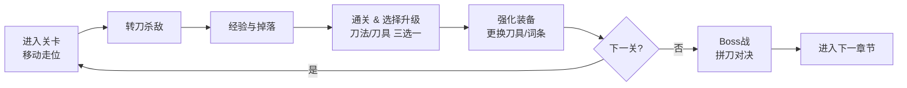

# 游戏概述

> 所属模块：01 游戏概念 | 依赖：无 | 被依赖：全部模块

---

## 1. 游戏类型定位

- **类型**：Rogue 转刀动作游戏（类《鸠摩智转刀》）
- **视角**：2D 俯视角（Top-Down）
- **平台**：Web（HTML5 Canvas + TypeScript），PC 浏览器运行
- **单局时长**：约 20-30 分钟（6 关）
- **操作复杂度**：极简（仅 WASD）
- **核心卖点**：转刀爽快感 + 拼刀博弈深度 + 装备 Build 多样性

### 与《鸠摩智转刀》的异同

| 维度 | 《鸠摩智转刀》 | 《藏锋出鞘》 |
| --- | --- | --- |
| 操作 | 方向键/摇杆 | 仅 WASD |
| 转刀 | 核心机制 | 核心机制，加入可升级的旋转参数（转速/范围/多刀） |
| 升级 | 被动选项 | **双线升级**：刀法（技巧）+ 刀具（器刃） |
| 武器 | 固定 | **装备系统**：20 把刀具 + 词条 + 套装 |
| 敌人刀具 | 部分敌人持刀 | **拼刀系统**：所有持刀敌人参与刀具碰撞判定，胜负由体积与转速决定 |
| 剧情 | 无 | **主线剧情**：铁匠 → 武林盟主，6 关 6 章节 |

## 2. 世界观一句话

> 江湖乱世，铁匠之子"陈锋"在父亲铁匠铺被灭门后，握起家传钝刀踏上复仇与问鼎之路，从无名铁匠一路拼杀，最终在武林大会上出鞘问鼎盟主之位。

（详见 [世界观与角色](../08-story/世界观与角色.md)）

## 3. 核心玩法循环

**单关内循环（约 60-90 秒）**：
1. 进入随机生成的房间/区域
2. WASD 走位移动，刀具自动旋转，斩杀小怪
3. 精英/持刀怪触发拼刀博弈
4. 清怪后 Boss 战（偶数关）
5. 通关 → 三选一升级 + 装备奖励

**每局整体循环（20-30 分钟）**：
- 6 关主线：铁匠铺 → 黑风寨 → 断魂谷 → 铸剑山庄 → 神刀门 → 武林大会
- 每关结束获得升级选项与装备奖励
- Boss 战为每关高潮，拼刀机制深度发挥
- 阵亡则本局结束，保留解锁与图鉴进度

## 4. 操作说明

| 按键 | 功能 |
| --- | --- |
| **W** | 向上移动 |
| **A** | 向左移动 |
| **S** | 向下移动 |
| **D** | 向右移动 |
| **方向键/数字键** | 升级选择界面确认选项（1/2/3 或 ←→） |
| **ESC** | 暂停 / 返回 |

> 设计目标：**单手即可游玩**。战斗中玩家唯一动作是走位，攻击与旋转全部自动，将操作负担降到最低，策略重心放在"走到哪、何时拼刀、怎么养 Build"。

## 5. 核心特色卖点

### 5.1 转刀 —— 移动即攻击

角色持刀以自身为圆心持续旋转，刀具化作旋转的弧形刀光。旋转参数由"刀法"与"刀具"共同决定，形成**技能之外的第二套成长维度**。

### 5.2 双线升级 —— 刀法与刀具

- **刀法等级**：技巧向。提升转速、旋转半径、多刀数量、连击计数等。
- **刀具等级/刀具本体**：器刃向。提升伤害、刀长、刀宽、击退、特效。

两者独立升级、相互加成，形成"技巧 Build"与"器刃 Build"两大流派。

### 5.3 拼刀 —— 以刃对刃

敌方持刀单位同样拥有刀体。双方刀体相撞时触发**拼刀判定**：
- 依据 **刀体动量**（刀长 × 刀宽 × 角速度 × 品质）计算胜负
- 胜者：击溃对方刀具，造成拼刀伤害 + 破势收益
- 败者：刀体被弹开、僵直，短暂失去攻击能力
- 势均力敌：双方同时弹开，硬碰硬

拼刀是**高风险高回报**的核心博弈：主动迎刃而上可瞬间瓦解强敌攻势，但拼输则会暴露破绽。

### 5.4 装备 Build

刀具图鉴收录 20 把差异化刀具，配合护甲、饰品、秘籍槽位与 6 套套装效果，支持转速流、范围流、多刀流、连击流、暴击流、吸血续航流等多种 Build。

### 5.5 武侠剧情

铁匠之子的复仇与问鼎之路，6 章主线，每章一个 Boss 与一段江湖恩怨。Boss 皆为携带刀具的强者，最终 Boss 武林盟主是全书最凶险的拼刀对手。

## 6. 目标受众与体验目标

| 维度 | 设计 |
| --- | --- |
| 目标受众 | 喜欢吸血鬼幸存者类刷子游戏、转刀爽游、武侠题材的玩家 |
| 上手门槛 | 10 秒学会操作，30 秒进入状态 |
| 单局节奏 | 前期（1-2关）快速爽快，中期（3-4关）Build 成型挑战加深，后期（5-6关）高压拼刀与极限走位 |
| 复玩动机 | 随机升级、多 Build、图鉴收集、难度挑战 |
| 心流目标 | 保持"走位-斩杀-选择"的高频反馈循环，避免长时间无奖励的空窗 |

## 7. 游戏名释义

《藏锋出鞘》：
- **藏锋**：主角身世 —— 铁匠之子，家传钝刀藏锋不露；也指江湖之中强者敛刃。
- **出鞘**：主角成长线 —— 从被迫握刀，到主动出鞘问鼎；也对应最终 Boss 战的"刀出鞘"时刻。
- 双关：既是刀的叙事，也是主角的成长弧线。

## 8. 设计检查清单

- [x] 类型定位与差异化明确（与《鸠摩智转刀》的异同）
- [x] 核心玩法循环闭环（移动→转刀→升级→推进）
- [x] 操作说明完整（仅 WASD + 升级选择）
- [x] 五大核心卖点提炼（转刀/双线/拼刀/装备/剧情）
- [x] 目标受众与体验目标定义
- [x] 世界观一句话与游戏名释义
- [ ] 详细数值见 `06-balance/`（后续模块落地）

---

> 下一步：阅读 [02 战斗与碰撞系统](../02-combat/转刀机制.md)
