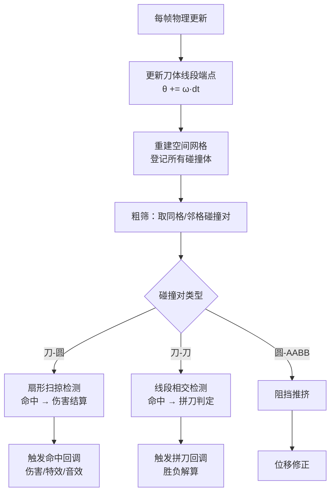

# 碰撞引擎设计

> 所属模块：02 战斗与碰撞系统 | 依赖：转刀机制 | 被依赖：拼刀机制、小怪图鉴、Boss设计、碰撞引擎实现

---

## 1. 设计目标

自研 2D 碰撞引擎，支撑：
- 玩家刀体（旋转线段）与敌人（圆形）的**命中检测**
- 玩家刀体与敌方刀体（旋转线段）的**拼刀检测**
- 实体与地形/边界的**阻挡检测**
- 60fps 下最多 60 个敌人 + 3 条玩家刀体 + 若干敌方刀体的实时碰撞

## 2. 碰撞体类型定义

| 类型 | 形状 | 用于 | 表示 |
| --- | --- | --- | --- |
| Circle | 圆 | 角色、敌人本体、掉落物 | `{ x, y, r }` |
| AABB | 轴对齐矩形 | 地形障碍、静态物 | `{ x, y, w, h }` |
| LineSegment | 旋转线段 | **刀体**（玩家/敌方） | `{ p1, p2 }` 每帧由圆心+角度+长度计算 |
| Sector | 扇形 | 刀体扫掠的高级表示（可选） | `{ center, radius, a1, a2 }` |

## 3. 空间分区：均匀网格 Grid

### 3.1 原理

将场景划分为固定大小的网格单元（cell），每帧仅将碰撞体登记到其所在及相邻的单元格，检测时只测试**同格/邻格**内的碰撞对，避免全量两两检测。

```
场景 2400x1350px，cell 120x120px → 20 x 12 = 240 个格子
```

### 3.2 登记规则

- 圆形/线段都通过其包围盒（Bounding Box）计算覆盖的格子范围
- 每帧重建网格（动态场景，重建开销 O(n)）
- 平均每个 cell 期望实体数 < 5，保证检测对数可控

### 3.3 性能预算

| 指标 | 预算 |
| --- | --- |
| 目标帧率 | 60 FPS |
| 单帧碰撞检测时间预算 | ≤ 3ms |
| 最大动态实体数 | 60 敌人 + 玩家 + 8 条敌方刀体 + 掉落物 |
| 最大碰撞对 | ~300 对/帧（经网格裁剪） |

## 4. 碰撞检测算法

### 4.1 刀体（线段） vs 敌人（圆） —— 核心命中检测

每帧刀体线段两点为 `P1`（刀柄端）、`P2`（刀尖端），敌人圆心 `C`、半径 `r`。

```
线段-圆最近距离 d：
    d = 点到线段(P1P2)的距离(C)
相交条件：d ≤ W/2 + r      （W 为刀宽，扩展命中厚度）
```

**高速旋转穿透问题**：旋转角速度最高约 7.7 rad/s（120% 加成后），帧内角位移可达 7.7/60 ≈ 0.128 rad，刀尖线速度 = 7.7 × 130px ≈ 1000px/s，单帧位移 ≈ 17px，可能跨过半径 10px 的敌人导致漏检。

### 4.2 扫掠碰撞（防穿透）

对高速运动的刀体采用**子步进 + 扇形扫掠**：

- **方案A 子步进**：将单帧旋转拆为 2-3 个等分角步，每步检测一次（开销 ×2-3，网格已裁剪，可控）
- **方案B 扇形扫掠**：将本帧 θ_old→θ_new 的扫过区域表示为扇形，直接检测扇形与圆的相交。精确且单次检测，推荐作为主方案

**扇形-圆相交检测**：
```
扇形 = { center: 圆心O, r0: 刀柄半径0.35L, r1: L, 角度范围 θ_old→θ_new }
与圆(C, r)相交条件：
  1) dist(O, C) ≤ r1 + r 且 ≥ max(r0 - r, 0)
  2) C 相对 O 的方位角在 [θ_old - δ, θ_new + δ] 范围内（δ 为容差，补偿刀宽）
```

### 4.3 线段 vs 线段（拼刀检测）

双方刀体为旋转线段，检测两线段是否相交：

```
线段A(P1,P2) vs 线段B(Q1,Q2)：
    使用向量叉积符号法判定相交
    （标准线段相交判定，见 09-tech/碰撞引擎实现.md 代码）
```

拼刀检测**只做粗筛后的精筛**：先看两线段所属格是否相邻，再判断两刀圆心的**距离范围**（都在各自旋转半径内才可能相交），最后精确线段相交判定。

### 4.4 圆 vs AABB（阻挡）

分离轴定理（SAT）的简化 2D 形式：圆与矩形最近点距离 ≤ r 即碰撞。用于角色/敌人与地形障碍的阻挡与推挤。

## 5. 碰撞检测流程



## 6. 碰撞响应

| 碰撞类型 | 响应 |
| --- | --- |
| 刀-圆（命中） | 结算伤害 → 击退敌人 → 命中特效/音效 → 更新连击计数 |
| 刀-刀（拼刀） | 进入拼刀判定流程（详见 [拼刀机制](拼刀机制.md)） |
| 圆-AABB（阻挡） | 位移回退到紧贴障碍，处理推挤与寻路绕行 |
| 玩家-敌人 | 轻量弹性碰撞（软碰撞），避免完全阻挡走位 |

## 7. 碰撞回调接口（TypeScript 签名预览）

```typescript
interface ICollisionListener {
    onBladeHitEnemy(blade: Blade, enemy: Enemy, hitPoint: Vec2): void;
    onBladeClash(myBlade: Blade, foeBlade: Blade, hitPoint: Vec2): void;
    onBodyBlocked(entity: Entity, obstacle: AABB): void;
    onEntityTouch(e1: Entity, e2: Entity): void;
}

interface ICollisionEngine {
    step(dt: number): void;                 // 每帧执行：更新-粗筛-精筛-回调
    register(shape: Shape, owner: Entity): void;
    unregister(owner: Entity): void;
}
```

## 8. 性能优化策略

| 策略 | 说明 |
| --- | --- |
| 空间分区 Grid | 主优化手段，检测对数从 O(n²) 降到近线性 |
| 粗筛优先 | 先距离判断再精确相交，用包围盒快速拒绝 |
| 扫掠而非多次迭代 | 扇形扫掠一次检测等效多次子步进，省开销 |
| 惰性更新 | 静止地形不进网格重建流程 |
| 对象池 | 碰撞事件对象、特效对象池化，避免 GC 卡顿 |

## 9. 与各系统关联

| 关联系统 | 关系 |
| --- | --- |
| [转刀机制](转刀机制.md) | 刀体为旋转线段，参数由转刀系统驱动 |
| [拼刀机制](拼刀机制.md) | 刀-刀碰撞触发拼刀判定 |
| [碰撞引擎实现](../09-tech/碰撞引擎实现.md) | 本设计的 TypeScript 落地 |
| [小怪图鉴](../05-enemy/小怪图鉴.md) | 敌方刀体同样用旋转线段表示 |
| [伤害公式](../06-balance/伤害公式.md) | 命中后的伤害结算 |

## 10. 设计检查清单

- [x] 碰撞体类型定义（Circle/AABB/LineSegment/Sector）
- [x] 空间分区 Grid 方案与性能预算
- [x] 刀-圆命中检测（线段-圆 + 刀宽扩展）
- [x] 防穿透：扇形扫掠 + 子步进方案
- [x] 刀-刀拼刀检测（线段相交）
- [x] 圆-AABB 阻挡检测
- [x] 完整检测流程
- [x] 碰撞响应规则
- [x] 回调接口定义
- [x] 性能优化策略

---

> 下一步：[拼刀机制](拼刀机制.md)
