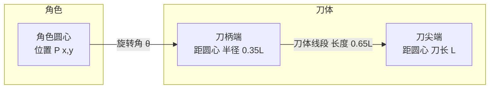

# 转刀机制

> 所属模块：02 战斗与碰撞系统 | 依赖：01 游戏概述 | 被依赖：碰撞引擎、拼刀机制、刀法升级树、伤害公式

---

## 1. 设计目标

转刀是《藏锋出鞘》的**唯一攻击方式**，也是手感的核心。目标：

- 玩家零操作成本持续输出，专注走位决策
- 旋转参数可被"刀法"与"刀具"两套体系强化，形成成长反馈
- 刀体为后续碰撞引擎与拼刀机制提供物理基础

## 2. 刀体旋转模型

### 2.1 基本概念

- **角色**：圆形碰撞体，半径 R（默认 18px），位于场景中，由 WASD 控制移动
- **刀体**：以角色为圆心旋转的**扇形/线段碰撞体**，由刀具属性决定其长度与张角
- **旋转**：刀体绕角色圆心匀速旋转，角速度由刀法等级与刀具修正共同决定

### 2.2 刀体几何定义

| 参数 | 符号 | 定义 | 默认基准值 |
| --- | --- | --- | --- |
| 刀长 | L | 刀尖到旋转中心的距离 | 80px（随刀具变化 50-140） |
| 刀宽 | W | 刀体线段的扫掠宽度（碰撞厚度） | 6px（随刀具变化 4-12） |
| 刀柄比例 | α | 刀柄端距圆心的比例 | 0.35（刀体有效段 0.35L→L） |
| 张角 | φ | 刀体扫过的角度（含刀宽） | 与 W、L 相关，约 3°-8° |

**碰撞表示**：单刀时刀体为一条以角色为圆心的旋转线段（从 0.35L 到 L）；多刀时多条线段按相位均分圆周。碰撞判定时线段按 W 扩展为胶囊扫掠体。

## 3. 旋转参数体系

### 3.1 基础旋转参数

| 参数 | 符号 | 说明 | 公式/基准 |
| --- | --- | --- | --- |
| 角速度 | ω | 每秒旋转角度 | `ω = ω0 × (1 + 0.06×(刀法等级-1)) × 刀具转速修正` |
| 基准角速度 | ω0 | 1级刀法、无修正 | 200°/s ≈ 3.49 rad/s（约 0.56 圈/秒） |
| 旋转半径 | Rrot | 即刀长 L 的有效斩杀半径 | 由刀具决定 |
| 多刀数量 | N | 同时旋转的刀体数 | 刀法技能"刀影分身"解锁，最多 3 |
| 连击计数 | C | 刀体命中同一目标的连续次数 | 影响连击伤害倍率 |
| 旋转方向 | dir | 顺时针/逆时针 | 默认顺时针，可被刀法"逆刃"反转 |

### 3.2 刀法等级对旋转的影响

刀法等级 Lv 从 1 到 20 级，提供全局旋转增益：

| 刀法等级 | 角速度加成 | 旋转半径加成 | 解锁内容 |
| --- | --- | --- | --- |
| 1-4 | +0% ~ +18% | 0% | 基础连击（最多 2 连） |
| 5 | +30% | +5% | 连击上限 3 |
| 9 | +48% | +10% | 技能"逆刃"（方向反转） |
| 12 | +66% | +12% | 连击上限 4 |
| 15 | +84% | +15% | 技能"刀影分身"（多刀 2） |
| 18 | +102% | +18% | 连击上限 5 |
| 20 | +120% | +20% | 技能"万刃归一"（多刀 3，终极） |

> 完整升级数值见 [04 升级系统](../04-upgrade/刀法升级树.md)

### 3.3 刀具对旋转的影响

刀具通过**转速修正**（部分刀具稍慢但伤害高）与 **刀长/刀宽**影响旋转手感：

- 刀长越长 → 旋转半径越大、斩杀范围越广，但刀体动量高、拼刀强
- 刀宽越宽 → 碰撞判定更宽、命中判定更宽容，但旋转时"风阻"（若实现）可降低转速
- 部分刀具带**特殊旋转效果**：如"圆月弯刀"转速+15%、"巨阙重刀"旋转半径+25%但转速-20%

## 4. 旋转方向控制逻辑

- 默认 **顺时针** 旋转，方向固定，玩家无需按键控制
- 刀法技能"**逆刃**"：可每 8 秒主动切换旋转方向，用于应对特定敌人的出刀方位
- 旋转方向对拼刀判定无直接加成，但影响**拼刀中相对角速度**的计算（见 [拼刀机制](拼刀机制.md)）

## 5. 命中判定与伤害结算流程

1. 每帧更新旋转角 θ += ω × dt
2. 碰撞引擎检测刀体线段与敌人碰撞体是否相交（详见 [碰撞引擎设计](碰撞引擎设计.md)）
3. 命中后进入**连击窗口**（同一目标 0.5 秒内再次被命中计为连击）
4. 结算伤害：`伤害 = 刀具基础伤害 × 刀法系数 × 装备加成 × 连击倍率`（详见 [伤害公式](../06-balance/伤害公式.md)）
5. 命中触发命中反馈（击退、特效、音效）

### 连击倍率表

| 连击数 | 倍率 |
| --- | --- |
| 1 | 1.00 |
| 2 | 1.15 |
| 3 | 1.30 |
| 4 | 1.50 |
| 5 | 1.80 |

## 6. 刀体视觉表现规范

- 刀体渲染为：刀柄（短粗线段）+ 刀刃（长细线段）+ 刀光（尾部渐变弧光）
- 旋转时产生**残影/拖尾**（Canvas 轨迹），体现高速旋转感
- 命中瞬间刀光闪白 + 击中小火花粒子
- 拼刀瞬间全屏轻微震动 + 金铁交鸣特效
- 刀体颜色随刀具品质变化：白/绿/蓝/紫/橙

## 7. 与各系统关联

| 关联系统 | 关系 |
| --- | --- |
| [碰撞引擎设计](碰撞引擎设计.md) | 刀体作为旋转线段参与碰撞检测 |
| [拼刀机制](拼刀机制.md) | 刀体与敌方刀体的碰撞触发拼刀判定 |
| [刀法升级树](../04-upgrade/刀法升级树.md) | 刀法等级提供转速/半径/多刀/连击增益 |
| [刀具图鉴](../03-equipment/刀具图鉴.md) | 刀具属性决定刀长/刀宽/转速修正 |
| [伤害公式](../06-balance/伤害公式.md) | 命中伤害结算 |

## 8. 手感与反馈设计

| 反馈 | 设计 |
| --- | --- |
| 命中反馈 | 敌人受击闪白、击退位移、血条跳动、火花粒子 |
| 击杀反馈 | 刀光扩散、敌尸碎裂、掉落光点、连杀计数 |
| 拼刀反馈 | 金铁交鸣音效、屏幕震动、胜负双方状态图标 |
| 转速反馈 | 刀光残影密度随转速提升，高转速时刀光呈"圆盘状" |

## 9. 设计检查清单

- [x] 刀体旋转几何模型定义（线段/扇形、刀长/刀宽/张角）
- [x] 旋转参数体系（角速度/半径/多刀/连击/方向）
- [x] 刀法等级对旋转的完整影响表
- [x] 刀具对旋转的影响
- [x] 旋转方向控制（默认 + 逆刃技能）
- [x] 命中判定与伤害结算流程 + 连击倍率表
- [x] 视觉表现规范
- [x] 与其他系统的关联
- [x] 手感与反馈设计

---

> 下一步：[碰撞引擎设计](碰撞引擎设计.md)
