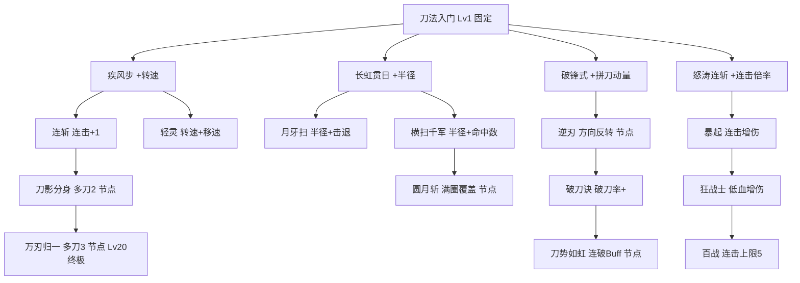

# 刀法升级树

> 所属模块：04 升级系统 | 依赖：转刀机制、拼刀机制 | 被依赖：升级曲线与经验、平衡性分析

---

## 1. 设计目标

刀法升级是**技巧向**的成长线，决定旋转表现（转速/范围/多刀/连击/方向）。目标：

- 提供清晰的流派方向选择（4 大流派）
- 每次 3 选 1，选择即定义 Build 走向
- 满级 20 级，每级 1 个选项，约 18 次选择（首级固定起点）

## 2. 四大流派

| 流派 | 核心属性 | 风格 | 代表选项 |
| --- | --- | --- | --- |
| **疾风（转速）** | ω ↑、连击 | 高频打击、快速清怪 | 疾风步、连斩、刀影分身 |
| **惊鸿（范围）** | 半径 ↑、多刀 | 大范围覆盖、安全输出 | 长虹贯日、月牙扫、万刃归一 |
| **破刃（拼刀）** | 动量 ↑、逆刃 | 主动拼刀、瓦解强敌 | 逆刃、破锋式、刀势如虹 |
| **连击（爆发）** | 连击倍率 ↑ | 单体爆发、Boss 杀手 | 怒涛连斩、暴起、狂战士 |

## 3. 升级机制规则

- 每次升级弹出 **3 选 1** 面板（暂停游戏）
- 选项从对应流派池中按权重随机抽取，已满级选项不再出现
- **首级固定**：1 级固定获得"刀法入门"（基础连击上限 2）
- 部分选项为**节点型**（解锁新机制，如逆刃、多刀），每局只能解锁一次
- 部分选项为**数值型**（可重复升级，每次叠加）

## 4. 刀法升级技能树（Mermaid）

## 5. 选项池总表

### 5.1 疾风流（转速）

| 选项 | 类型 | 效果 | 最大层数 | 出现权重 |
| --- | --- | --- | --- | --- |
| 刀法入门 | 固定(Lv1) | 连击上限 2，基础解锁 | 1 | - |
| 疾风步 | 数值 | 转速 +8% | 5 | 高 |
| 连斩 | 节点 | 连击上限 +1 | 3 | 中 |
| 轻灵 | 数值 | 转速 +5%、移速 +5% | 3 | 中 |
| 刀影分身 | 节点 | 多刀 +1（共 2） | 1 | 低（需 Lv15） |
| 万刃归一 | 节点(终极) | 多刀 +1（共 3），全属性 +10% | 1 | 极低（需 Lv20） |

### 5.2 惊鸿流（范围）

| 选项 | 类型 | 效果 | 最大层数 | 出现权重 |
| --- | --- | --- | --- | --- |
| 长虹贯日 | 数值 | 旋转半径 +8% | 5 | 高 |
| 月牙扫 | 数值 | 半径 +5%、击退力 +15% | 3 | 中 |
| 横扫千军 | 数值 | 半径 +5%、单次命中目标 +1 | 3 | 中 |
| 圆月斩 | 节点 | 刀体张角扩大为满圈覆盖（全方向命中） | 1 | 低（需 Lv12） |

### 5.3 破刃流（拼刀）

| 选项 | 类型 | 效果 | 最大层数 | 出现权重 |
| --- | --- | --- | --- | --- |
| 破锋式 | 数值 | 拼刀动量 +10% | 4 | 高 |
| 逆刃 | 节点 | 解锁旋转方向切换（CD 8s） | 1 | 中（需 Lv9） |
| 破刀诀 | 数值 | 破刀触发率 +5% | 3 | 低 |
| 刀势如虹 | 节点 | 连续 3 次拼刀胜触发 8s 全属性 +20% | 1 | 低（需 Lv15） |

### 5.4 连击流（爆发）

| 选项 | 类型 | 效果 | 最大层数 | 出现权重 |
| --- | --- | --- | --- | --- |
| 怒涛连斩 | 数值 | 连击伤害倍率 +0.1/层 | 5 | 高 |
| 暴起 | 数值 | 连击 ≥3 时伤害 +12% | 3 | 中 |
| 狂战士 | 数值 | HP < 40% 时刀法全属性 +15% | 2 | 中 |
| 百战 | 节点 | 连击上限 +1（最高 5） | 2 | 低（需 Lv12/18） |

## 6. 升级选项抽取规则

1. 升级时从四个流派池中各按权重抽取候选
2. 去除已满级/未达等级要求/已解锁节点的选项
3. 从剩余候选中按权重选出 3 个，保证不重复
4. 若剩余不足 3 个，从"通用数值池"（疾风步/长虹贯日/破锋式/怒涛连斩）补足
5. 每 5 级强制出现 1 个**节点型**选项（若可解锁），保证 Build 关键节点不被埋没

## 7. 刀法等级对旋转的影响（汇总）

| 刀法等级 | 角速度加成 | 旋转半径加成 | 连击上限 | 多刀 | 备注 |
| --- | --- | --- | --- | --- | --- |
| 1 | +0% | 0% | 2 | 1 | 入门 |
| 5 | +30% | +5% | 3 | 1 | 第一节点窗口 |
| 9 | +48% | +10% | 3 | 1 | 可解锁逆刃 |
| 12 | +66% | +12% | 4 | 1 | 可解锁圆月斩/百战 |
| 15 | +84% | +15% | 4 | 2(若点) | 可解锁分身/刀势如虹 |
| 18 | +102% | +18% | 5 | 2 | 百战第二层 |
| 20 | +120% | +20% | 5 | 3(若点) | 万刃归一终极 |

> 角速度加成 = `0.06 × (Lv-1)`，为基础成长（不含技能选项的额外加成）

## 8. 与各系统关联

| 关联系统 | 关系 |
| --- | --- |
| [转刀机制](../02-combat/转刀机制.md) | 提供 ω/半径/多刀/连击参数 |
| [拼刀机制](../02-combat/拼刀机制.md) | ω 影响动量，逆刃影响相对角速度 |
| [升级曲线与经验](升级曲线与经验.md) | 升级频率与经验产出 |
| [平衡性分析](../06-balance/平衡性分析.md) | Build 强度评级依据 |

## 9. 设计检查清单

- [x] 4 大流派与核心属性定义
- [x] 升级机制规则（3 选 1、节点型/数值型）
- [x] Mermaid 技能树图
- [x] 选项池总表（含效果/层数/权重/等级要求）
- [x] 抽取规则
- [x] 等级影响汇总表

---

> 下一步：[刀具强化路线](刀具强化路线.md)
