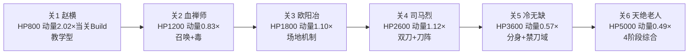

# Boss设计

> 所属模块：05 敌人与Boss系统 | 依赖：碰撞引擎设计、拼刀机制、小怪图鉴 | 被依赖：伤害公式、平衡性分析、关卡设计、主线剧情脚本

---

## 1. 设计目标

6 个 Boss 对应 6 关，每个 Boss 是该关的高潮与剧情节点。所有 Boss **均携带刀具**，拼刀机制在 Boss 战中发挥到极致。目标：

- 每个 Boss 有独特**阶段机制**与**拼刀规则**
- 难度梯度递进，迫使玩家综合运用走位、Build、拼刀
- Boss 战时长 60-90 秒（终 Boss 最终阶段可延长至 110 秒），节奏紧凑不拖沓
- Boss 背景与剧情深度绑定（详见 [主线剧情脚本](../08-story/主线剧情脚本.md)）

## 2. Boss 总览

| 关卡 | Boss名称 | 身份 | HP | 刀体动量(基准) | 阶段数 | 核心机制 | 击杀奖励 |
| --- | --- | --- | --- | --- | --- | --- | --- |
| 1 | 黑风寨主·赵横 | 山匪头领 | 800 | 2.02×当关Build | 2 | 横扫+冲锋 | 精钢刀、200金 |
| 2 | 血禅师 | 断魂谷邪教首领 | 1200 | 0.83×当关Build | 2 | 召唤+毒域 | 雁翎刀、300金 |
| 3 | 铸剑老人·欧阳冶 | 铸剑山庄庄主 | 1800 | 1.10×当关Build | 3 | 熔炉场地+重击 | 玄铁重刀、破镜重圆、400金 |
| 4 | 神刀门主·司马烈 | 神刀门掌门 | 2600 | 1.12×当关Build | 3 | 双刀+刀阵 | 龙鳞刀、500金 |
| 5 | 伪盟主·冷无缺 | 篡位武林盟主 | 3600 | 0.57×当关Build | 3 | 影分身+禁刀域 | 虎啸狂刀、800金 |
| 6 | 武林盟主·天绝老人 | 最终Boss | 5000 | 0.49×当关Build | 4 | 全机制综合 | 屠龙刀/藏锋·无名、1000金、结局 |

> 倍数口径：Boss 动量 / 当关玩家预期 Build 动量（当关推荐刀法/刀具 + 当关可获最佳拼刀向刀具）。关1 Boss 强压制（玩家拼刀胜率约 33%）；随玩家 Build 成型，中后期比值下降、胜率上升，终 Boss 靠阶段4 连拼3次破防机制压难度，而非纯动量压制。

## 3. Boss 通用机制

### 3.1 阶段切换

- Boss 按 HP 阈值切换阶段（如 100%-60% 阶段1，60%-30% 阶段2，30%-0% 阶段3）
- 切换时短暂无敌+全屏特效+台词，重置部分技能 CD
- 每阶段行为模式与攻击组合不同，难度递增

### 3.2 Boss 刀体与拼刀

- 所有 Boss 持刀，刀体为旋转线段（同玩家）
- Boss 刀体动量高于玩家基准（见总览表），主动拼刀胜率被压低（约 30-40%）
- Boss 特定技能有**拼刀窗口**（出刀前摇期间玩家拼刀胜率 +0.15），鼓励抓时机
- 部分Boss有**破刀抗性**（破刀触发率减半）

### 3.3 击杀奖励

- 必掉紫+装备（关3+必掉橙）
- 大量金币与金属碎片
- 解锁下一关与剧情

## 4. 各 Boss 详细设计

> **M8 实现标注**：每个 Boss 已实现 2-3 个代表性技能（阶段机/血条分段/拼刀窗口/破刀打断全量）；熔炉场地/禁刀域/刀光雨慢镜头等复杂场地机制为后续打磨项。

### 4.1 关1 Boss：黑风寨主·赵横

| 属性 | 值 |
| --- | --- |
| HP | 800 |
| 移速 | 80 |
| 伤害 | 18（接触）/ 28（横扫） |
| 刀长/刀宽/ω/Q | 90/7/180°(3.14)/1.15 |
| 刀体动量 | ≈2270（当关玩家Build 2.02倍） |

**阶段1（100%-60%）**：追踪玩家 + 周期横扫（前摇0.6s，扇形范围打击）
**阶段2（60%-0%）**：增加冲锋技能（蓄力1s后直线冲撞，可被拼刀打断），移速+20%

**拼刀规则**：常规拼刀，冲锋前摇期间为拼刀窗口（玩家胜率+0.15）
**击杀奖励**：精钢刀（绿）、200金、20碎片
**剧情**：灭门仇人之一，主角首杀（详见剧情脚本第1章）

### 4.2 关2 Boss：血禅师

| 属性 | 值 |
| --- | --- |
| HP | 1200 |
| 移速 | 70 |
| 伤害 | 16（接触）/ 20（毒域）/ 24（血刀斩） |
| 刀长/刀宽/ω/Q | 85/6/200°(3.49)/1.3 |
| 刀体动量 | ≈2314（当关玩家Build 0.83倍） |

**阶段1（100%-55%）**：施毒（地面毒域减速+持续伤害）+ 挥刀
**阶段2（55%-0%）**：召唤2只血刀僧协助（血刀僧正式登场于关3，此处为关2 Boss 前置召唤，属性取关2缩放值）+ 血刀斩（远程弧形刀光，可被拼刀抵消）

**拼刀规则**：血刀斩弹道可被玩家刀体击碎（瞬时拼刀，胜率固定70%）
**击杀奖励**：雁翎刀（蓝）、300金、30碎片
**剧情**：邪教首领，掌控断魂谷

### 4.3 关3 Boss：铸剑老人·欧阳冶

| 属性 | 值 |
| --- | --- |
| HP | 1800 |
| 移速 | 65 |
| 伤害 | 24（接触）/ 35（重击）/ 持续（熔炉灼烧） |
| 刀长/刀宽/ω/Q | 110/10/160°(2.79)/1.5 |
| 刀体动量 | ≈4606（当关玩家Build 1.10倍，巨刃型） |

**阶段1（100%-65%）**：场地两侧熔炉喷火（灼烧区域）+ 挥重刀
**阶段2（65%-30%）**：重击（前摇1.2s，大范围震击+击退），需走位或拼刀打断
**阶段3（30%-0%）**：熔炉全面喷发（安全区缩小），Boss 狂暴移速+30%

**拼刀规则**：重击前摇为拼刀窗口（胜率+0.2），成功拼刀可打断重击；Boss 刀体动量极高，正面拼刀劣势大，需抓窗口
**击杀奖励**：玄铁重刀（蓝）、破镜重圆（剧情刀）、400金、40碎片
**剧情**：主角父亲的故友，亦敌亦师（详见剧情脚本第3章）

### 4.4 关4 Boss：神刀门主·司马烈

| 属性 | 值 |
| --- | --- |
| HP | 2600 |
| 移速 | 85 |
| 伤害 | 22×2（双刀）/ 30（刀阵） |
| 刀长/刀宽/ω/Q | 95/7/220°(3.84)/1.5（双刀） |
| 刀体动量 | ≈3836×2（双刀，当关玩家Build 1.12倍） |

**阶段1（100%-60%）**：双刀旋转追踪 + 间歇冲刺斩
**阶段2（60%-25%）**：刀阵（释放6把旋转飞刀环绕自身，扩大攻击范围）
**阶段3（25%-0%）**：刀阵飞出（6把飞刀射向玩家，可被拼刀抵消），自身双刀加速

**拼刀规则**：刀阵飞刀可被拼刀击碎（每把独立判定）；本体双刀正面拼刀劣势大，建议绕侧或抓冲刺前摇
**击杀奖励**：龙鳞刀（紫）、500金、50碎片
**剧情**：武林大派掌门，与伪盟主勾结

### 4.5 关5 Boss：伪盟主·冷无缺

| 属性 | 值 |
| --- | --- |
| HP | 3600 |
| 移速 | 90 |
| 伤害 | 26（接触）/ 32（影分身斩）/ 持续（禁刀域） |
| 刀长/刀宽/ω/Q | 100/8/240°(4.19)/1.5 |
| 刀体动量 | ≈5028（当关玩家Build 0.57倍） |

**阶段1（100%-60%）**：高速斩击 + 瞬移背刺
**阶段2（60%-30%）**：影分身（召唤2个分身，分身刀体动量为本体50%，HP1点可被一击破）
**阶段3（30%-0%）**：禁刀域（场地中央区域玩家刀体停转，需在域外战斗）+ 狂暴连斩

**拼刀规则**：影分身可被拼刀一击破（动量低）；禁刀域内无法拼刀；本体需抓瞬移落地的0.5s硬直拼刀
**击杀奖励**：虎啸狂刀（紫）、800金、60碎片
**剧情**：篡位盟主，主角复仇关键目标

### 4.6 关6 Boss：武林盟主·天绝老人（最终Boss）

| 属性 | 值 |
| --- | --- |
| HP | 5000 |
| 移速 | 85 |
| 伤害 | 30（接触）/ 40（天绝斩）/ 35（万刃风暴） |
| 刀长/刀宽/ω/Q | 115/9/230°(4.01)/1.8 |
| 刀体动量 | ≈7471（当关玩家Build 0.49倍，终极强敌，阶段4靠连拼机制压难度） |

**阶段1（100%-70%）**：沉稳剑术，单刀挥击+气劲波（远程）
**阶段2（70%-40%）**：万刃风暴（自身高速旋转形成刀光风暴，范围大需拉开）
**阶段3（40%-15%）**：双刀模式（取出第二把刀，双刀旋转，刀体动量×1.5）
**阶段4（15%-0%）**：终式·天绝（全场刀光雨+自身瞬移斩，需连续拼刀化解刀光雨）

**拼刀规则**：
- 阶段1气劲波可被拼刀抵消
- 阶段2万刃风暴期间 Boss 无敌，玩家只能走位规避
- 阶段3双刀正面拼刀极劣势，需抓双刀交替间隙
- 阶段4刀光雨每波可被拼刀击碎，连续成功拼刀3次触发"刀势如虹"破防窗口，此时Boss破防受伤+100%

**击杀奖励**：屠龙刀（橙）/ 藏锋·无名（橙，若持家传刀通关）、1000金、100碎片、结局解锁
**剧情**：武林盟主，全书最强，主角问鼎之路的终极对手（详见剧情脚本第6章结局）

## 5. Boss 难度梯度设计

难度递进维度：HP、动量、阶段数、机制复杂度上升；拼刀难度由「关1纯动量压制」过渡到「关6阶段机制博弈」，玩家 Build 成型后动量比下降但 Boss 机制复杂度上升，难度梯度平滑。

## 6. Boss 战时长测算

以玩家关n预期DPS测算（数据引自 [平衡性分析](../06-balance/平衡性分析.md) §2.1 DPS 推导链，统一数据源）：

| Boss | HP | 玩家DPS(关n) | 纯输出时长 | 实际时长(含走位/拼刀) |
| --- | --- | --- | --- | --- |
| 赵横 | 800 | 30 | 27s | 60-75s |
| 血禅师 | 1200 | 55 | 22s | 65-80s |
| 欧阳冶 | 1800 | 103 | 17s | 75-90s |
| 司马烈 | 2600 | 135(×2=270) | 19s | 80-95s |
| 冷无缺 | 3600 | 257(×2=514) | 14s | 85-100s |
| 天绝老人 | 5000 | 403(×2=806) | 12s | 90-110s |

> 注：关4-6 玩家多刀解锁，DPS 按 ×2 计；纯输出时长 = HP/DPS，实际时长含走位/拼刀/阶段机制，与 §1 目标 60-90s（终Boss至110s）一致。

## 7. 与各系统关联

| 关联系统 | 关系 |
| --- | --- |
| [碰撞引擎设计](../02-combat/碰撞引擎设计.md) | Boss刀体碰撞检测 |
| [拼刀机制](../02-combat/拼刀机制.md) | Boss拼刀规则与窗口 |
| [小怪图鉴](小怪图鉴.md) | Boss召唤的小怪引用 |
| [关卡设计](../07-level/关卡设计总览.md) | Boss战作为关底 |
| [主线剧情脚本](../08-story/主线剧情脚本.md) | Boss背景与战前台词 |
| [平衡性分析](../06-balance/平衡性分析.md) | Boss战力与玩家DPS测算 |
| [刀具图鉴](../03-equipment/刀具图鉴.md) | Boss掉落刀具 |

## 8. 设计检查清单

- [x] 6 个 Boss 对应 6 关，全部持刀
- [x] 完整属性表（HP/移速/伤害/刀参/动量）
- [x] 每个 Boss 2-4 阶段，含切换条件与行为模式
- [x] 拼刀规则与窗口定义
- [x] 击杀奖励配置
- [x] 难度梯度图
- [x] 战时长测算
- [x] 与剧情脚本关联

---

> 下一步：[伤害公式](../06-balance/伤害公式.md)
