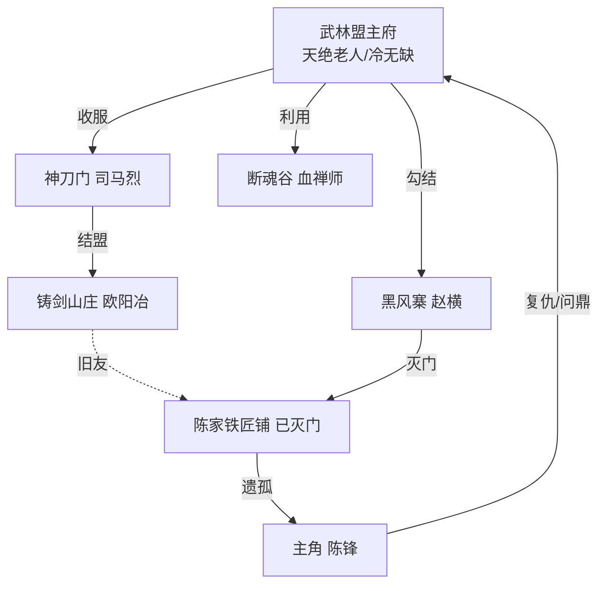
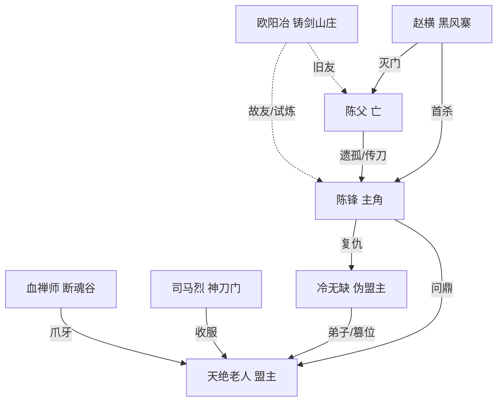

# 世界观与角色

> 所属模块：08 剧情系统 | 依赖：关卡设计、Boss设计 | 被依赖：主线剧情脚本

---

## 1. 世界观设定

### 1.1 时代与背景

架空武侠世界，江湖纷争。武林以"**武林大会**"为最高权力裁决，胜者为**武林盟主**，号令群雄。近年武林动荡，老盟主退隐，新盟主"天绝老人"凭绝世刀法登顶，却行事诡谲，暗中打压刀法流派、扶持爪牙，江湖暗流涌动。

### 1.2 刀法流派体系

江湖刀法分**五大流派**，对应游戏内 Build 方向：

| 流派 | 特色 | 代表势力 | 游戏映射 |
| --- | --- | --- | --- |
| 疾风刀 | 快速连击、轻灵 | 游侠散人 | 疾风流(转速) |
| 惊鸿刀 | 大开大合、范围 | 军阵刀法 | 惊鸿流(范围) |
| 破刃刀 | 以刃对刃、破势 | 铸剑一脉 | 破刃流(拼刀) |
| 连环刀 | 连绵不绝、爆发 | 山匪悍匪 | 连击流(爆发) |
| 藏锋道 | 内敛浑厚、全能力 | 失传古法 | 藏锋套(终极) |

### 1.3 势力格局

| 势力 | 立场 | 关卡 | 关键人物 |
| --- | --- | --- | --- |
| 铁匠铺(陈家) | 主角出身，已灭门 | 关1 | 陈锋(主角)、陈父(亡) |
| 黑风寨 | 山匪，灭门执行者 | 关1-2 | 赵横 |
| 断魂谷邪教 | 邪修，贩毒弄权 | 关3 | 血禅师 |
| 铸剑山庄 | 中立偏正，与陈家有旧 | 关4 | 欧阳冶 |
| 神刀门 | 名门正派，被盟主收服 | 关5 | 司马烈 |
| 武林盟主府 | 最高权力，实为篡位者把持 | 关6 | 冷无缺(伪)、天绝老人(真) |

### 1.4 势力关系图

## 2. 主角设定

### 陈锋

| 项 | 设定 |
| --- | --- |
| 身份 | 陈家铁匠铺之子，铁匠学徒 |
| 年龄 | 19 |
| 性格 | 沉稳内敛、外柔内刚，藏锋不露（呼应游戏名） |
| 外貌 | 粗布短打，手臂有铁匠烫伤旧痕，眉宇坚毅 |
| 成长动机 | 父亲被黑风寨灭门后，握起家传钝刀"藏锋"，踏上复仇与问鼎之路 |
| 核心矛盾 | 铁匠出身却走刀客之路；复仇执念 vs 武林大义；藏锋 vs 出鞘 |
| 武学起点 | 无刀法根基，凭铁匠对"刃"的理解，自悟旋转挥刀 |
| 成长弧线 | 被动握刀 → 主动历练 → 直面篡位者 → 问鼎盟主，家传刀觉醒 |

### 家传刀"藏锋"

陈家祖传钝刀，看似凡铁，实为失传古法所铸，刃藏锋芒。随主角成长逐步觉醒，最终形态"藏锋·无名"为终极神兵（橙品）。若主角持家传刀通关关6，触发觉醒结局。

## 3. 主要NPC设定

### 欧阳冶（铸剑老人）

| 项 | 设定 |
| --- | --- |
| 身份 | 铸剑山庄庄主，陈父故友 |
| 性格 | 孤傲重情，惜才 |
| 与主角关系 | 亦敌亦师，关3 Boss，战败赠刀"破镜重圆"并指引真相 |
| 武学 | 破刃刀+铸剑重击 |

### 陈父（亡）

| 项 | 设定 |
| --- | --- |
| 身份 | 陈家铁匠铺主，已故 |
| 背景 | 曾是隐世刀客，退隐为铁匠，藏锋刀传人 |
| 作用 | 灭门回忆、遗言指引主角，是主角精神支柱 |

## 4. Boss角色设定

### 赵横（黑风寨主）

山匪头领，灭门执行者，粗莽凶悍，刀法蛮横。关1 Boss，主角首杀对象。

### 血禅师

断魂谷邪教首领，修血刀邪术，阴鸷狡诈。控制毒域，为盟主府敛财。

### 欧阳冶（见NPC节）

### 司马烈（神刀门主）

神刀门掌门，刀法大家，双刀绝技。表面名门正派，实已被盟主收服，关4 Boss。

### 冷无缺（伪盟主）

篡位者，原为天绝老人弟子，窃据盟主之位。擅影分身与禁刀域，阴狠毒辣。关5 Boss，主角复仇关键。

### 天绝老人（武林盟主，真）

真正的武林盟主，绝世刀客，全书最强。表面退隐实则幕后操控。刀法登峰造极，四阶段综合机制。关6最终Boss，主角问鼎的终极对手。

## 5. 角色关系总览

## 6. 设计检查清单

- [x] 世界观背景与时代设定
- [x] 五大刀法流派与游戏Build映射
- [x] 六大势力格局与关系图
- [x] 主角陈锋完整设定（性格/动机/弧线）
- [x] 家传刀"藏锋"设定与觉醒机制
- [x] 主要NPC（欧阳冶、陈父）
- [x] 6个Boss角色设定
- [x] 角色关系总览图

---

> 下一步：[主线剧情脚本](主线剧情脚本.md)
