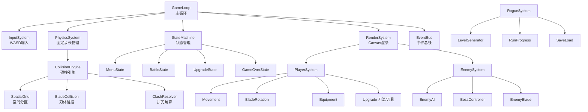

# 架构设计

> 所属模块：09 技术实现指南 | 依赖：全部系统 | 被依赖：碰撞引擎实现、渲染管线、游戏代码实现

---

## 1. 整体架构

采用 **游戏循环 + 实体系统 + 状态机 + 事件总线** 的轻量架构，无第三方引擎，纯 TypeScript + Canvas 2D。



## 2. 核心接口定义

### 2.1 实体与组件

```typescript
interface Entity {
    id: number;
    tags: Set<string>;
    active: boolean;
    transform: Transform;        // 位置、旋转、缩放
    collider?: Collider;         // 碰撞体（可选）
    renderer?: Renderer;         // 渲染器（可选）
}

interface Transform {
    pos: Vec2;
    rotation: number;            // 弧度
    scale: Vec2;
}

type Collider =
    | { type: 'circle'; r: number }
    | { type: 'aabb'; w: number; h: number }
    | { type: 'segment'; p1: Vec2; p2: Vec2; width: number };  // 刀体；width 为刀宽（命中厚度扩展，见碰撞引擎设计 §4.1）
```

### 2.2 系统

```typescript
interface ISystem {
    update(dt: number, ctx: GameContext): void;
}

interface GameContext {
    entities: EntityManager;
    events: EventBus;
    input: InputState;
    player: IPlayer | null;      // IPlayer 抽象接口（player 模块实现），避免 core→player 循环依赖；Menu 等无玩家状态为 null
    rng: RNG;                    // 种子随机
}
```

### 2.3 状态机

```typescript
interface IGameState {
    enter(ctx: GameContext): void;
    update(dt: number, ctx: GameContext): void;
    exit(ctx: GameContext): void;
    render?(g: CanvasRenderingContext2D, alpha: number, ctx: GameContext): void;  // 可选：状态专属渲染（alpha 为固定步长插值系数）
}
// 状态：Menu / Battle / Upgrade / Paused / GameOver / Victory
```

### 2.4 事件总线

```typescript
interface EventBus {
    on(event: string, handler: (payload: any) => void): void;   // 实现为泛型 EventMap 类型化（公开 API 兼容），on 返回取消函数
    emit(event: string, payload: any): void;
}
// 关键事件：
// 'enemy.killed', 'player.hit', 'blade.hit', 'blade.clash',
// 'level.up', 'level.cleared', 'boss.phase', 'item.drop'
```

## 3. 模块划分

| 模块 | 职责 | 主要类 |
| --- | --- | --- |
| `core/` | 引擎核心 | GameLoop, GameContext, EventBus, StateMachine, RNG |
| `math/` | 数学工具 | Vec2, 线段相交, 几何运算 |
| `physics/` | 碰撞引擎 | CollisionEngine, SpatialGrid, BladeCollision, ClashResolver |
| `entity/` | 实体管理 | Entity, EntityManager, Transform, Collider |
| `player/` | 玩家系统 | PlayerEntity, BladeRotator, Equipment, Upgrade |
| `enemy/` | 敌人系统 | Enemy, EnemyAI, BossController, EnemyBlade |
| `rogue/` | Rogue运行 | LevelGenerator, RunProgress, SaveLoad |
| `render/` | 渲染 | RenderSystem, BladeRenderer, ParticleSystem, Camera |
| `ui/` | 界面 | HUD, UpgradePanel, Inventory, Dialog |
| `data/` | 配置数据 | 刀具/小怪/Boss/关卡/词条 配置(JSON/TS) |
| `input/` | 输入 | InputSystem (WASD) |

## 4. 目录结构规划

```
zhuandao/
├── src/
│   ├── main.ts                 # 入口，初始化GameLoop
│   ├── core/
│   │   ├── GameLoop.ts
│   │   ├── GameContext.ts
│   │   ├── EventBus.ts
│   │   ├── StateMachine.ts
│   │   └── RNG.ts
│   ├── math/
│   │   ├── Vec2.ts
│   │   └── Geometry.ts         # 线段相交、点到线段距离等
│   ├── physics/
│   │   ├── CollisionEngine.ts
│   │   ├── SpatialGrid.ts
│   │   ├── BladeCollision.ts
│   │   └── ClashResolver.ts
│   ├── entity/
│   │   ├── Entity.ts
│   │   ├── EntityManager.ts
│   │   └── Collider.ts
│   ├── player/
│   │   ├── PlayerEntity.ts
│   │   ├── BladeRotator.ts
│   │   ├── Equipment.ts
│   │   └── Upgrade.ts
│   ├── enemy/
│   │   ├── Enemy.ts
│   │   ├── EnemyAI.ts
│   │   ├── BossController.ts
│   │   └── EnemyBlade.ts
│   ├── rogue/
│   │   ├── LevelGenerator.ts
│   │   ├── RunProgress.ts
│   │   └── SaveLoad.ts
│   ├── render/
│   │   ├── RenderSystem.ts
│   │   ├── BladeRenderer.ts
│   │   ├── ParticleSystem.ts
│   │   └── Camera.ts
│   ├── ui/
│   │   ├── HUD.ts
│   │   ├── UpgradePanel.ts
│   │   ├── Inventory.ts
│   │   └── Dialog.ts
│   ├── input/
│   │   └── InputSystem.ts
│   └── data/
│       ├── blades.ts           # 刀具图鉴数据
│       ├── enemies.ts          # 小怪数据
│       ├── bosses.ts           # Boss数据
│       ├── levels.ts           # 关卡配置
│       ├── upgrades.ts         # 升级选项池
│       └── equipment.ts        # 装备/词条/套装数据
├── wiki/                       # 本WIKI
├── assets/                     # 美术/音频资源
├── index.html
├── tsconfig.json
└── package.json
```

## 5. 配置驱动设计

所有数值外置为 TypeScript 配置常量（`src/data/*.ts`），便于调参与热重载。示例：

```typescript
// data/blades.ts
export const BLADES: Record<string, BladeData> = {
    '铁匠刀': {
        quality: 'white',
        baseDamage: 18,
        length: 80,
        width: 6,
        speedMod: 0,
        special: null,
        obtainLevel: 1,
        desc: '父亲留下的钝刀...',
    },
    // ...
};
```

## 6. 性能预算

| 指标 | 预算 |
| --- | --- |
| 目标帧率 | 60 FPS |
| 单帧总耗时 | ≤ 16.6ms |
| 物理/碰撞 | ≤ 3ms |
| 渲染 | ≤ 8ms |
| 逻辑/AI | ≤ 3ms |
| 最大实体 | ~80（含敌人+刀体+掉落） |

## 7. 与各系统关联

| 关联系统 | 关系 |
| --- | --- |
| [碰撞引擎实现](碰撞引擎实现.md) | 物理模块详细实现 |
| [渲染管线](渲染管线.md) | 渲染模块详细实现 |
| 全部设计文档 | 数据配置来源 |

## 8. 设计检查清单

- [x] 整体架构图（循环+实体+状态+事件）
- [x] 核心接口定义（Entity/System/State/Event）
- [x] 模块划分与职责
- [x] 完整目录结构规划
- [x] 配置驱动设计
- [x] 性能预算

---

> 下一步：[碰撞引擎实现](碰撞引擎实现.md)
