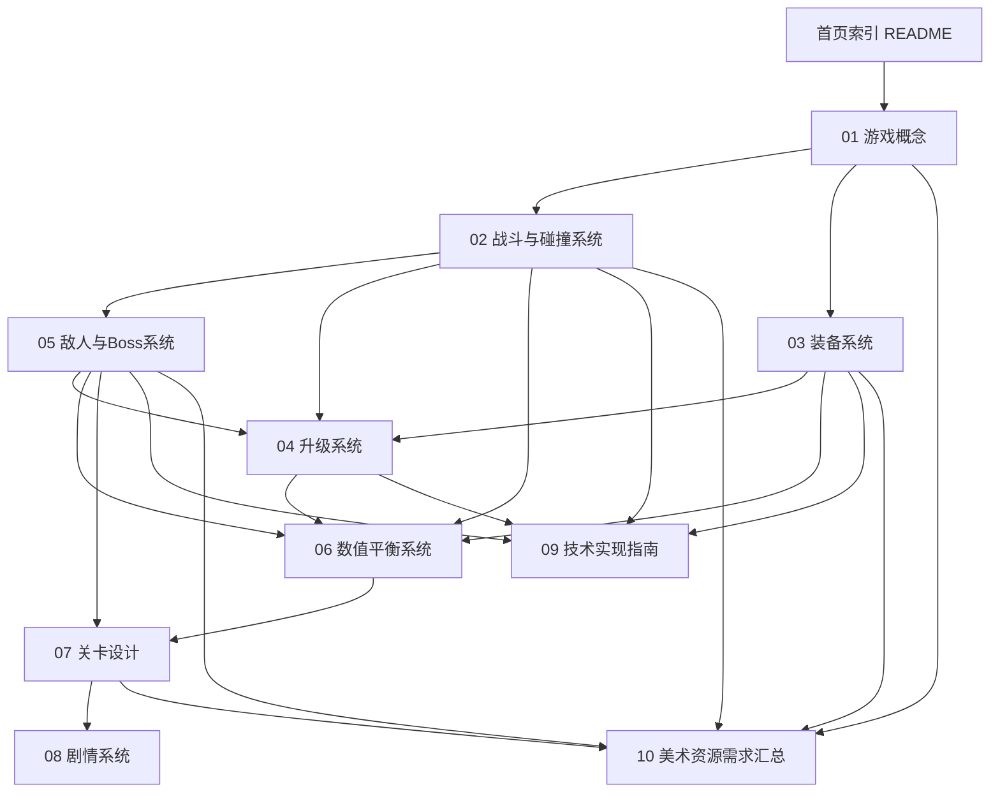

# 《藏锋出鞘》游戏设计 WIKI

> 一把铁匠锤下敲出的刀，从铁匠铺到武林盟主的传奇。
> 类《鸠摩智转刀》的 Rogue 转刀动作游戏 —— 完整设计文档集。

---

## 项目简介

《藏锋出鞘》是一款 **Rogue 转刀动作游戏**。玩家仅需 **WASD** 移动，角色手持刀具自动旋转攻敌，在移动走位中打出华丽的旋转斩击。每次通关关卡后从升级选项中挑选强化，逐步打磨"刀法"与"刀具"双线成长，通过 **拼刀** 机制与携带刀具的敌人正面博弈，一路从铁匠铺战至武林大会问鼎盟主。

- **操作极简**：只有 WASD，移动即战斗
- **双线成长**：刀法（技巧）与刀具（器刃）独立升级
- **拼刀博弈**：双方刀具相撞，凭体积与转速定胜负
- **装备 Build**：刀具图鉴、套装词条、Build 多样化
- **Rogue 结构**：随机关卡、随机升级、每局皆不同

## 技术栈

| 项目 | 选型 |
| --- | --- |
| 引擎 | HTML5 Canvas 2D + TypeScript（无第三方游戏引擎，自研轻量框架） |
| 碰撞引擎 | 自研 2D 碰撞系统（旋转线段扫掠检测 + 空间分区） |
| 渲染 | Canvas 2D Context 分层渲染 |
| 游戏循环 | requestAnimationFrame + 固定时间步长物理更新 |

## 文档目录树

```
wiki/
├── README.md                    ← 本文件（首页索引）
├── 01-game-concept/
│   └── 游戏概述.md               → 游戏概念、核心玩法循环、设计哲学
├── 02-combat/
│   ├── 转刀机制.md               → 刀体旋转模型、旋转参数、刀法影响
│   ├── 碰撞引擎设计.md           → 2D碰撞引擎、空间分区、扫掠检测
│   └── 拼刀机制.md               → 拼刀判定、胜负公式、解算与反馈
├── 03-equipment/
│   ├── 装备系统总览.md           → 槽位、品质、词条、获取
│   ├── 刀具图鉴.md               → 20把刀具完整属性表
│   └── 套装与词条.md             → 6套套装、词条池、数值范围
├── 04-upgrade/
│   ├── 刀法升级树.md             → 四大流派、3选1升级池
│   ├── 刀具强化路线.md           → 强化维度与分支
│   └── 升级曲线与经验.md         → 1-20级双线经验表
├── 05-enemy/
│   ├── 小怪图鉴.md               → 15种小怪完整属性与AI
│   └── Boss设计.md               → 6个Boss完整机制
├── 06-balance/
│   ├── 伤害公式.md               → 完整伤害计算体系
│   ├── 属性总表.md               → 全属性集中参考表
│   └── 平衡性分析.md             → 战力曲线、难度梯度、Build评级
├── 07-level/
│   └── 关卡设计总览.md           → 6关详细设计 + Rogue生成规则
├── 08-story/
│   ├── 世界观与角色.md           → 武侠世界、势力、角色设定
│   └── 主线剧情脚本.md           → 6章完整剧情脚本
├── 09-tech/
│   ├── 架构设计.md               → 代码架构、模块划分、接口定义
│   ├── 碰撞引擎实现.md           → TypeScript实现方案与核心算法
│   └── 渲染管线.md               → Canvas渲染、粒子、动画
├── 10-art/
│   └── 美术资源需求汇总.md         → 角色/刀具/敌人/Boss/场景/UI特效资源清单与里程碑
├── 11-report/
│   ├── 数值校验报告.md            → 14篇文档数值复算与跨文档比对结论
│   ├── 数值优化分步方案.md        → 数值问题修复的分步方案与执行记录
│   └── 测试小修记录.md            → 测试期 bug/交互小修流水（持续追加，记录约定见文档头）
└── assets/
    └── concept-art/              → 概念美术图（卡通 2D 武侠风格：主角/刀具/Boss/场景）
```

## 文档依赖关系图



## 阅读指引

- **想快速了解游戏是什么**：读 `01-game-concept/游戏概述.md`
- **想了解战斗怎么打**：读 `02-combat/` 三篇（转刀 → 碰撞 → 拼刀）
- **想了解怎么成长变强**：读 `03-equipment/` + `04-upgrade/`
- **想知道要打什么怪**：读 `05-enemy/`
- **想核对数值是否合理**：读 `06-balance/`（最终权威数据在 `属性总表.md`）
- **想了解关卡与剧情**：读 `07-level/` + `08-story/`
- **想了解美术交付清单**：读 `10-art/美术资源需求汇总.md`
- **想开始写代码**：读 `09-tech/`

## 术语表

| 术语 | 定义 |
| --- | --- |
| **转刀** | 角色持刀以自身为圆心持续旋转攻击的核心玩法 |
| **刀法** | 主角的技巧等级，影响转速、范围、连击等旋转表现 |
| **刀具** | 主角手持的武器，有独立属性与等级，影响伤害与体积 |
| **拼刀** | 玩家刀体与敌方刀体相撞时的判定与解算机制 |
| **刀体** | 以角色为圆心旋转的扇形/线段碰撞体，即刀具的碰撞表示 |
| **刀法系数** | 由刀法等级换算的伤害/属性加成系数 |
| **刀体动量** | 拼刀胜负判定的核心参数，由刀长×刀宽×角速度×品质计算 |
| **Build** | 通过升级与装备组合形成的战斗流派 |
| **Rogue 结构** | 关卡随机生成、升级选项随机三选一、失败重开的结构 |

## 数值与文档一致性约定

1. **权威数据**：所有数值以 `06-balance/属性总表.md` 为最终权威，其他文档若与此冲突以属性总表为准
2. **基准关卡**：数值表均标注基准关卡（1-6关），未标注默认为关卡1
3. **交叉引用**：文档间使用相对链接，如 `[转刀机制](../02-combat/转刀机制.md)`
4. **更新维护**：任何数值调整必须同步更新属性总表、平衡性分析与涉及的图鉴文档

## 变更记录

| 版本 | 日期 | 说明 |
| --- | --- | --- |
| v0.1 | 2026-08-14 | WIKI 初版，建立全部 9 大模块共 20 篇设计文档 + 6 张概念美术图 |
| v0.2 | 2026-08-14 | 新增第 10 模块「美术资源需求汇总」文档，补充目录树/依赖图/阅读指引 |
| v0.3 | 2026-08-15 | 美术方向整体调整为"卡通 2D 武侠"，重绘 6 张概念图（主角/藏锋刀/屠龙刀/天绝老人/铁匠铺/武林大会）并更新风格规范与索引 |
| v0.4 | 2026-08-15 | 按 10-art 规范批量生成剩余美术资源：18 把刀具、15 种小怪、5 个 Boss、30 个 UI 图标、5 张特效雪碧图（均卡通 2D 武侠、透明无底色），落库 `wiki/assets/concept-art/` 各子目录，更新资源索引 |
| v0.5 | 2026-08-19 | 开发里程碑 1（引擎核心脚手架）落地：按代码实现同步更新 09-tech/架构设计.md —— `GameContext.player` 改为 `IPlayer` 抽象接口（防循环依赖）、`EventBus` 类型化（泛型 EventMap，公开 API 兼容）、`Collider.segment` 补 `width` 刀宽字段（命中厚度公式 d ≤ W/2 + r）、`IGameState` 补可选 `render` 方法。代码见 `src/`（Vite + TS strict + Vitest，71 单测全通过） |
| v0.6 | 2026-08-19 | 开发里程碑 2（碰撞引擎与渲染管线）落地：碰撞引擎实现.md —— 命中 CD 由刀体级 0.1s 改为「刀体-敌人对」级 0.25s（修复多敌漏伤与同圈重复结算）、补命中双保险检测（线段-圆 ∪ 扇形扫掠）与容差公式 δ=atan2(W/2+r, 0.35L)；拼刀机制.md —— 补三种结果概率分配（胜 p、败平各 (1-p)/2）、破刀触发明确为 2 倍动量+破刀诀+30% 概率、平局补失去刀体 0.5s；转刀机制.md —— 连击窗口 0.5s 放宽为 2.5s（修正单刀永远叠不出连击的数值矛盾）。138 单测全通过，运行时冒烟验证命中/拼刀/阻挡/相机全模块 |
| v0.7 | 2026-08-19 | 开发里程碑 3（玩家转刀战斗闭环）落地：转刀机制.md —— 连击上限表对齐属性总表（阶梯 Lv1-4=2/5-9=3/10-19=4/20=5，修正原 Lv12=4/Lv18=5 与属性总表的冲突）；伤害公式.md §7 补玩家受击无敌帧 0.5s。战斗闭环运行时验证：击杀→经验→升级→拼刀→受击全链路数值精确吻合（192 单测通过） |
| v0.8 | 2026-08-19 | 开发里程碑 4（全量数据配置）落地：刀具图鉴.md —— 标题"20 把"修正为 19 把（与属性总表 §7 一致，M4 正式裁决）；属性总表.md §5 —— 山贼头目标注「持刀型属性 + 精英位配置」双重身份。代码侧 src/data/ 六文件录入全量数据（19 刀/15 小怪/6 Boss/6 关/18 升级选项/19 词条/6 套装），并按文档修正 M3 遗留：击杀经验双线同计（升级曲线.md §3）、经验表换为 §4/§5 精确几何级数表。233 单测通过（含全量数值完整性校验） |
| v0.9 | 2026-08-19 | 开发里程碑 5（敌人系统与 AI）落地：小怪图鉴.md §5 新增「行为参数表」小节——冲刺三档参数（恶犬/铁甲护卫/剑奴）、自爆（60px 触发/1s 引信/×3 伤害/90px 半径）、AOE（0.6s/80px）、远程通用参数（射程 500/弹速 350/间隔 2.5-3.5s/走位区间 [300,500]）、飞刀瞬时拼刀规则（70% 胜率，沿用血刀斩先例）。15 种小怪完整 AI + 三类弹道 + 双刀相位差 π 运行时验证（239 单测通过） |
| v0.10 | 2026-08-19 | 开发里程碑 6（双线升级与装备系统）落地：游戏概述.md §4 操作说明补「空格=逆刃（Lv9 解锁，CD 8s）、B=背包」；装备系统总览.md §4 补小怪掉落概率（持刀 12%/精英 35%/无刀 3%）。三选一升级（抽取规则+18 选项效果+DOM 面板）、装备生成（品质权重→词条去重→互斥）、套装 2/4 件效果聚合、背包/熔铸/强化、多刀/逆刃/刀势如虹运行时全链路验证（260 单测通过） |
| v0.11 | 2026-08-19 | 新增 11-report/测试小修记录.md（测试期小修流水，后续同类修改按其头部约定持续追加）。#001：修复背包打开后无法关闭——B 键检测原置于暂停早退之后成死代码，前置到 update() 开头并提取 toggleInventory() 统一入口；新增右下角常驻「行囊 [B]」按钮实现鼠标开关双通道；升级面板期间屏蔽背包开关、exit 清理 DOM 防残留 |
| v0.12 | 2026-08-19 | 测试小修 #002/#003（记录于 11-report/测试小修记录.md）。#002 通关回满血：onLevelClear 补 heal(hpMax)，关卡设计总览.md §4 补通用过渡规则；#003 修复冲锋怪零前摇连冲：冲刺结束帧 dashTimer 过冲正值被误判为新蓄力致冷却完全失效，改为归零且冷却自冲刺结束起算重置满值（参数值不变），小怪图鉴.md §5.1 补冷却口径，重写/新增冲刺冷却单测（270 项全通过） |
